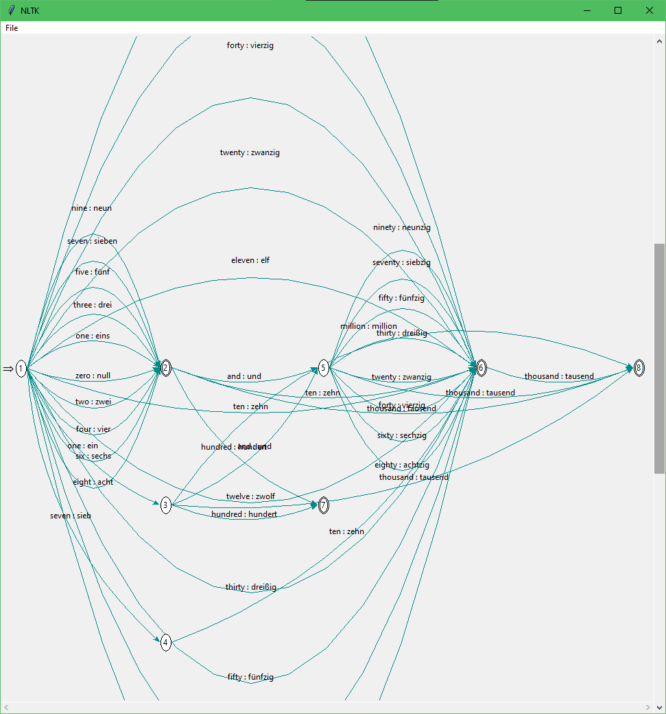

### CSC 4309 Natural Language Processing

**Semester 1 2020/2021**

**Assignment 1:** Finite State Transducer for German Numbers

**Team Member:**

1. Husnee
2. Akif
3. Muhammad Nuqman bin Manja (1719301)
4. Muhammad Amiruddin bin Bustaman (1711905)

### Description

Transliteration is the conversion of a text from one script to another. For example, the Arabic script **بيكتا**(i.e., written) can be converted to the Latin script **kitabi** for English. In German, numerals can be spelled out just like they are in English. Some numbers are independent while some are composed numbers. The numeral \*78** is written as **ach-und-sech-zigin** German which means **eight-and-seventy** in English. **Table 1** shows the transliterations (both in German and in transliterated English) for the numerals 1 to 19. When counting from 1-12, the German language uses independent numbers However, there is certain structure in the German numbers from “dreizehn” until “neunzehn” (13-19). These numbers are so called compound nouns. **FST** that receives any given **number as input** and **outputs the equivalent transliteration of the German numerals.** For example, the number **10** will output **zehn\*\* in German.

### Finite State Transducer

<h3 id=#IO >Input-Outputs File</h3>

**Input file:**

1. _"input.dat"_ - the numerals input (e.g. 1, 2, 23, 42, 97)
2. _"output.dat"_ - the output mapping of german numerals (e.g. zehn, drei-zehn, ein-und-vierzig, siebzig)

**Output file:**

1. _"German-trans.dat"_ - results of mapping and transduced english numerals in german number

### How to use

1. Edit **input.dat** and **output.dat** according to the format in the example shown [above](#IO).
2. Run `python GNFST.py ` and the results will be written in **"German-trans.dat"**.
